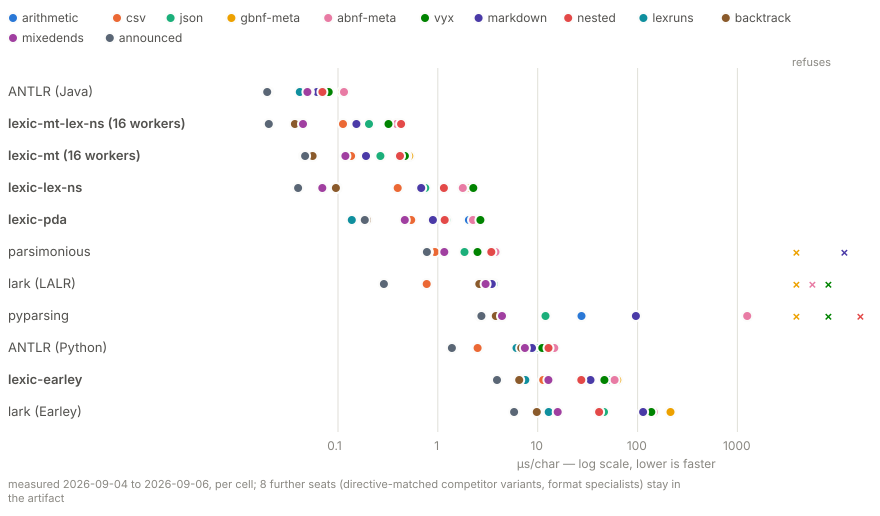
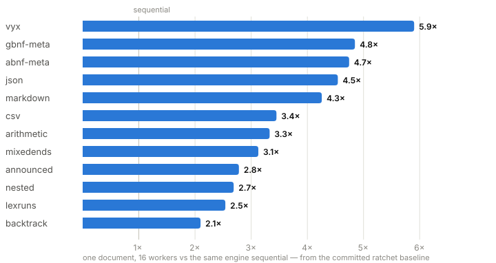
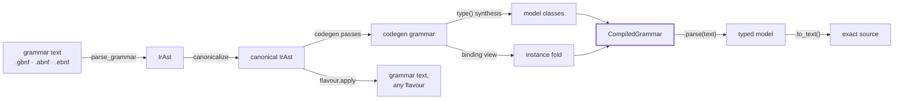

<div align="center">

# Lexic

**Grammar in. Typed models out. Byte-exact back.**

A grammar engine that compiles grammar files into typed Python object models —
parse text into them, reconstruct the source exactly, re-emit the grammar in
any notation, transpile both grammars *and* the documents they read, and
parse one document across many threads on free-threaded Python.


<!-- lexic:begin mt-badge -->

<!-- lexic:end mt-badge -->
<!-- lexic:begin tests-badge -->

<!-- lexic:end tests-badge -->


</div>

---

Lexic is the grammar engine layer of **Vyx**, an agent-to-agent protocol that
uses grammars, not prose, as the wire contract between agents.

## Install

```bash
uv add lexic             # or: pip install lexic — zero runtime dependencies
```

Requires Python 3.14+. Multithreaded parsing engages on the free-threaded
build (`3.14t`, e.g. `uv python install 3.14t`); on a standard build lexic
parses sequentially.

## Why lexic

| | |
|---|---|
| 🔬 **A native engine** | A scannerless Earley engine (full SPPF, Scott 2008) handles any context-free grammar — ambiguity and left recursion included — fused with a predictive PDA fast path. Every fast-path decision is licensed by static analysis of the grammar at hand; anything unprovable falls back to Earley, per rule, automatically. Correctness never depends on the fast path. |
| ⚡ **Fast, and measured honestly** | The [benchmark](#performance) races both engines against Lark, parsimonious, pyparsing and ANTLR on identical, differential-gated grammars — and its numbers in this README are rendered from committed artifacts, never typed in. |
| 🧵 **Multithreaded parsing** | On free-threaded Python, one document is split, parsed and stitched across workers — split plans derived from grammar structure, byte-identical results, ambiguity refusals preserved. |
| 📦 **Zero runtime dependencies** | The engine, the record spine models live on, and the layout engine that formats emitted text all ship in the package. `pip install` pulls in nothing. |
| 🔁 **Byte-exact round-trips** | `parse(text).to_text() == text` on every valid input, for every grammar in the corpus, under hypothesis-generated inputs. |
| 🔀 **Portable grammars** | All notations converge on one canonical IR: a grammar compiled from GBNF re-emits as ABNF or EBNF and back, reparse-equal, width-aware. |
| 🎛️ **Token streams & constrained generation** | Grammars over tokenizer vocabularies: parse token-granular, round-trip char-exact, and constrain an LLM's generation with a next-token mask on one live chart — real `tokenizer.json` vocabularies included. |
| ⚖️ **Ambiguity refused, never guessed** | Input that means two different things raises instead of a parser quietly picking. The opt-out is a resolver you supply, not a flag — and it reaches whichever engine ends up choosing. |
| 🪞 **Self-hosting** | The grammar notations are parsed by the same engine, from self-grammars authored as data — a flavour carries no parser code. Lexic parses its own exports back and cross-checks them against the compiler. |

## Performance

Cross-engine comparison — every engine gets the same grammar, derived
mechanically from the one `IrAst` lexic compiles, and every translation is
gated by a differential in both directions (each emitted grammar must accept
what lexic accepts *and refuse what lexic refuses*):



<!-- lexic:begin cross-bench -->
| grammar | **lexic-mt (16 workers)** | **lexic-lex-ns** | **lexic-pda** | **lexic-earley** | lark (LALR) | lark (Earley) | parsimonious | pyparsing | ANTLR (Python) | *ANTLR (Java)* |
|---|---|---|---|---|---|---|---|---|---|---|
| arithmetic | **0.58** | **1.81** | **2.20** | **68.8** | 2.81 | 52.9 | 2.45 | 23.5 | 8.74 | *0.13* |
| csv | **0.22** | **0.42** | **0.59** | **16.5** | 0.79 | 14.5 | 0.96 | 4.07 | 2.56 | *0.03* |
| json | **0.29** | **1.03** | **1.25** | **37.2** | 3.59 | 39.9 | 1.84 | 11.6 | 10.3 | *0.33* |
| gbnf-meta | **0.54** | **2.22** | **2.61** | **69.9** | refuses | 200.6 | refuses | refuses | 12.2 | *0.39* |
| abnf-meta | **0.48** | **1.85** | **2.30** | **67.4** | refuses | 140.3 | 3.69 | 38.1 | 14.4 | *0.35* |
| vyx | **0.53** | **2.28** | **2.76** | **53.8** | refuses | 104.1 | 2.41 | 16.9 | 11.1 | *0.22* |
| markdown | **0.23** | **0.70** | **0.91** | **39.0** | 3.41 | 99.2 | refuses | 95.8 | 8.72 | *0.09* |

µs/char, lower is faster; medians of isolated rounds; measured 2026-08-25; 9 further seats (directive-matched competitor variants, format specialists) stay in the artifact.
<!-- lexic:end cross-bench -->

Three things the table means, stated plainly:

- **ANTLR's Java target is the fastest single-threaded thing here, by an
  order of magnitude.** That is the honest result — and it is a
  *tool+runtime* comparison: that column is Java, every other column is
  Python.
- **`lexic-mt` is the fastest Python row on every grammar**, and sequential
  `lexic-pda` outruns `lark-lalr` on every grammar lark-lalr accepts while
  being the only Python engine that parses all seven — building a typed,
  byte-recoverable model, which no other row pays for. The one sequential
  loss: parsimonious edges the unmarked row on `vyx` (2.41 vs 2.76) while
  the directive-pruned rows stay ahead. A refusal is a genuine grammar
  conflict, printed as a result.
- **The engines do not build the same thing.** Lexic returns a typed model
  the source is byte-recoverable from; the others return generic trees.

## Multithreaded parsing

On free-threaded Python, lexic splits **one document** across workers: split
plans are derived from the grammar's own structure (region proofs, boundary
certification — no grammar-specific casing), pieces parse independently, and
the stitched model is byte-identical to the sequential parse, ambiguity
refusals included. Wall-clock speedup at 16 workers, per bench grammar:



The full Lexic ladder — directive-pruned rows (`@lexical`, `@non-semantic`)
and the 16-worker row beside the plain engines (µs/char, from the committed
regression baseline; a pre-commit ratchet confirms any >5% move in fresh
processes before it can land):

<!-- lexic:begin lexic-bench -->
| grammar | pda | `@lexical` | `@lexical` `@non-semantic` | 16-worker | speedup | earley |
|---|---|---|---|---|---|---|
| abnf-meta | 2.29 | 2.19 | 1.84 | 0.49 | **4.7×** | 69.3 |
| announced | 0.19 | 0.13 | 0.13 | 0.07 | **2.6×** | 4.82 |
| arithmetic | 2.10 | 1.92 | 1.86 | 0.59 | **3.6×** | 69.9 |
| backtrack | 0.26 | 0.19 | 0.18 | 0.08 | **3.1×** | 7.94 |
| csv | 0.56 | 0.42 | 0.42 | 0.17 | **3.3×** | 14.7 |
| gbnf-meta | 2.62 | 2.28 | 2.31 | 0.51 | **5.2×** | 70.5 |
| json | 1.24 | 1.04 | 1.05 | 0.30 | **4.1×** | 37.5 |
| lexruns | 0.20 | 0.18 | 0.18 | 0.07 | **3.0×** | 8.08 |
| markdown | 0.96 | 0.73 | 0.74 | 0.22 | **4.4×** | 40.3 |
| mixedends | 0.52 | 0.30 | 0.31 | 0.17 | **3.0×** | 15.9 |
| nested | 1.28 | 1.27 | 1.27 | 0.46 | **2.8×** | 34.4 |
| vyx | 2.73 | 2.39 | 2.41 | 0.47 | **5.8×** | 55.6 |
<!-- lexic:end lexic-bench -->

Run it yourself: `uv run python -m tools.benchmark.bench --rounds 3`, or
`--only json vyx` for a subset. The ANTLR Java row needs a JDK. Every number
above is rendered by `uv run python -m tools.render_readme` from
`tools/benchmark/*.json`; a suite invariant fails if this README drifts from
those artifacts.

## Quickstart

```python
from lexic.compile import compile_from_path

grammar = compile_from_path("resources/ground_truth/json.gbnf")

model = grammar.parse('{"stars": 3, "wip": null}')   # text → typed model
model.to_text()                                      # → the exact source, byte for byte
model.semantic_dump()                                # → dicts, structural noise stripped
model.to_grammar("abnf")                             # → the grammar itself, re-emitted in ABNF
```

**Grammar is the ground truth.** Model classes are Python's *view* of a
grammar — synthesized at runtime with `type()`, named and typed fields derived
from the grammar's structure, no code-generation step, no schema language on
the side. Every model has a lossless path back to canonical grammar text.

## Tokens — parse token streams, constrain generation

Lexic parses character streams by default, and **token streams** when a
grammar's terminals name tokens instead of characters — same engine, same
pipeline. A tokenizer is just an encoding whose ordinals are vocab ids, a
peer of unicode rather than a special case:

```gbnf
root     ::= <think> thinking </think> .*
thinking ::= !</think>*
```

`<think>` is the token whose spelling **is** `<think>` — llama.cpp's GBNF
semantics, described rather than prescribed. `<[7]>` names a token by id,
`<[3-9]>` an id range, `!<…>` any token but one, `.` any token at all.

```python
from lexic.compile import Vocabulary, compile_text
from lexic.ir import IrTokenizer

tok = IrTokenizer.from_vocab("tokens", {"<think>": 0, "</think>": 1, "hi": 2})
compiled = compile_text(GRAMMAR, vocabulary=Vocabulary(tok))

compiled.parse("<think>hi</think>")   # parse token-granular; to_text() char-exact
cursor = compiled.constrain()         # constrain generation
cursor.mask()                         # admissible next-token ids
cursor.push(0); cursor.accepts()      # advance; test completion
```

Three independent capabilities: read and emit token grammars with no
tokenizer at all; parse instances with one; **constrain generation token by
token** — the cursor holds a single live chart, `push` grows it instead of
reparsing the prefix, so `mask()` costs the candidate's spelling, not the
history. A vocabulary is per-deployment, not per-grammar: `compiled.bind(tok)`
rebinds without recompiling. Real tokenizers come straight from a
`tokenizer.json` — vocab, merges, normalizers, pre-token splits, byte
fallback, all derived from the file's own sections; `ex12` runs `<think>`
constrained decoding against a real 151k-token vocabulary. Depth:
[.wiki/lexic/tokens.md](.wiki/lexic/tokens.md).

## The pipeline



One canonical `IrAst` in the middle is what makes grammars portable: two
notations describing the same language converge on the same tree, and every
flavour is an emitter *from* that tree. The same engine parses grammar text
(each flavour's self-grammar is data) and instances (a positional fold over
the real codegen grammar).

## Getting started

Runnable, commented walkthroughs live in [`getting_started/`](getting_started/) —
run any of them as `uv run python -m getting_started.<name>`:

| # | Example | Shows |
|---|---|---|
| 01 | [`hello_grammar`](getting_started/ex01_hello_grammar.py) | Define a grammar inline, compile, parse, round-trip. |
| 02 | [`compile_from_file`](getting_started/ex02_compile_from_file.py) | Compile a bundled `.gbnf` and read fields. |
| 03 | [`parse_json`](getting_started/ex03_parse_json.py) | Parse nested JSON; `to_text()` and `semantic_dump()`. |
| 04 | [`transpile_flavours`](getting_started/ex04_transpile_flavours.py) | A grammar re-emitted in every notation, reparse-checked. |
| 05 | [`inspect_ir`](getting_started/ex05_inspect_ir.py) | The `__grammar__: IrRule` behind every compiled class. |
| 06 | [`token_grammar`](getting_started/ex06_token_grammar.py) | Token grammars: parse token-granular, round-trip, next-token mask. |
| 07 | [`constrained_generation`](getting_started/ex07_constrained_generation.py) | A generation loop: mask → pick → `push` until `accepts()`. |
| 08 | [`twin_module`](getting_started/ex08_twin_module.py) | Export an importable twin; lexic parses its own export back. |
| 09 | [`json_reducer`](getting_started/ex09_json_reducer.py) | `CompiledGrammar.reduce`: fold a document to IR values. |
| 10 | [`templating`](getting_started/ex10_templating.py) | Extract selected paths; skip the rest as raw spans. |
| 11 | [`hf_tokenizer`](getting_started/ex11_hf_tokenizer.py) | Read an HF `tokenizer.json` with lexic's own JSON grammar. |
| 12 | [`real_think_flow`](getting_started/ex12_real_think_flow.py) | `<think>` constrained decoding against a real 151k vocabulary. |
| 13 | [`payload_projection`](getting_started/ex13_payload_projection.py) | Ship a parsed value as a module that imports with no lexic installed. |
| 14 | [`ir_notation`](getting_started/ex14_ir_notation.py) | `repr` with an inverse: any IR value to a file and back, exactly. |
| 15 | [`yaml_twin_module`](getting_started/ex15_yaml_twin_module.py) | The whole build path on a language lexic ships no support for. |
| 16 | [`transpile_json_yaml`](getting_started/ex16_transpile_json_yaml.py) | Transpile a *document* between formats on the model plane. |
| 17 | [`transpile_python_cpp`](getting_started/ex17_transpile_python_cpp.py) | python → C++: grammar-derived ASTs, an authored transform, `to_text()`. |

## Flavours

| Flavour | Extension | Status |
|---|---|---|
| GBNF | `.gbnf` | Production — character-level, plus llama.cpp token terminals |
| ABNF | `.abnf` | Production — RFC 5234 + 7405, `%d`/`%b`/`%x` sequences, case markers, the B.1 core-rules prelude |
| EBNF | `.ebnf` | Production — ISO-family: `=`/`;` rules, `{}`/`[]`, `n * x` repetition, `(* *)` comments |

A *flavour* is a grammar notation carried entirely as data — a self-grammar,
a reducer, an escape codec and emit actions, with **zero parsing methods and
zero embedded code** — which is why a whole flavour round-trips through the IR
text notation: add one as a flat `grammars/<name>.py` module, or load one at
runtime from a text manifest with `load_flavour`. Constructs a notation cannot
spell (EBNF has no negation) are refused explicitly, never approximated.

## Beyond parsing

- **Transpile** — grammars between notations through the canonical IR, and
  *documents* between languages on the model plane, driven by a transform
  that is pure data — completeness, membership and fidelity gated on every
  run. → [.wiki/lexic/transpilation.md](.wiki/lexic/transpilation.md)
- **Reduce** — `compiled.reduce(text, reducer)` derives a pruned variant,
  parses only what the reading needs, and folds the result to IR values. A
  reducer is a *reading*; one compiled grammar can carry several.
- **Template** — `template(compiled, shape, spec)` parses one pass, models
  only the paths you keep, captures the rest as raw spans.
- **Generate** — `generate(...)` derives a random valid document from any
  grammar; `constrain()` masks a live generation.
- **Export** — `export_module` writes the importable twin of a compiled
  grammar; `export_value` writes any parsed value as flat literals readable
  with zero lexic imports. Both are verified on the way out: lexic parses its
  own exports back.
- **IR notation** — `load_ir` / `emit_ir`: a no-`exec` text notation that
  spells IR constructors, `repr` with an inverse. Grammars, reducers, whole
  flavours travel as text.

## Test grammars

`resources/ground_truth/` holds ten `.gbnf` grammars plus `.abnf` and `.ebnf`
siblings for cross-flavour parity, all exercised by the round-trip property
suite:

`arithmetic` · `c` · `chess` · `japanese` · `json` · `json_arr` · `json_ws` · `list` · `think` · `vyx`

## Development

Lexic uses [uv](https://docs.astral.sh/uv/). Always prefix commands with
`uv run` — never run `pytest` or `ruff` bare.

```bash
uv sync                                  # install (dev-only; no runtime deps)
uv run pytest tests/ -q                  # full suite
uv run ruff check src/ tests/            # lint
uv run python tools/check_generated.py   # generated-twin gate (pyright + pylint on every export)
tools/run_examples.sh                    # every getting_started example must exit 0
tools/run_checks.sh                      # the done-gate (ruff + pyright + whole-tree pylint)
tools/auto_fix.sh                        # mechanical fixes: ruff format → isort → ruff --fix
```

Architecture and design records live in the wiki:
[architecture](.wiki/lexic/architecture.md) ·
[IR shapes](.wiki/lexic/ir-shapes.md) ·
[public API](.wiki/lexic/public-api.md) ·
[flavour system](.wiki/lexic/flavour-system.md) ·
[parallel parsing](.wiki/lexic/parallel-parsing.md) ·
[decisions](.wiki/lexic/decisions.md). Public invariants:
[CLAUDE.md](CLAUDE.md) §Key invariants.

## Status

Pre-1.0, actively developed, APIs may change without notice. Where it stands
honestly: correctness and fidelity are the strengths — one grammar compiles to
typed classes that round-trip exactly, in any flavour, with ambiguity refused
rather than guessed at. Raw throughput against a mature generated parser in a
JIT'd runtime is not, and the benchmark above says so rather than choosing
inputs that hide it.

## License

Licensed under [LGPL](LICENSE).
