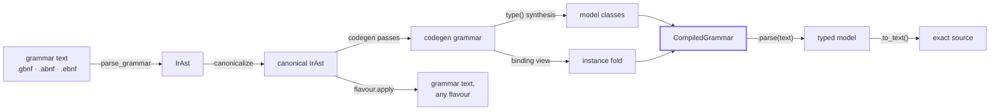

<div align="center">

# Lexic

**Grammar in. Typed models out. Byte-exact back.**

A grammar engine that compiles grammar files into typed Python object models —
parse text into them, reconstruct the source exactly, re-emit the grammar in
any notation, and transpile both grammars *and* the documents they read.


</div>

---

```python
from lexic.compile import compile_from_path

grammar = compile_from_path("resources/ground_truth/json.gbnf")

model = grammar.parse('{"stars": 3, "wip": null}')   # text → typed model
model.to_text()                                      # → the exact source, byte for byte
model.semantic_dump()                                # → dicts, structural noise stripped
model.to_grammar("abnf")                             # → the grammar itself, re-emitted in ABNF
```

**Grammar is the ground truth.** Model classes are Python's *view* of a
grammar — synthesized at runtime with `type()`, named and typed fields derived
from the grammar's structure, no code-generation step, no schema language on
the side. Every model has a lossless path back to canonical grammar text.

Lexic is the grammar engine layer of **Vyx**, an agent-to-agent protocol that
uses grammars, not prose, as the wire contract between agents.

## Why lexic

| | |
|---|---|
| 🔬 **A native engine** | A scannerless Earley engine (full SPPF, Scott 2008) handles any context-free grammar — ambiguity and left recursion included — fused with a predictive PDA fast path. Every fast-path decision is licensed by static analysis of the grammar at hand; anything unprovable falls back to Earley, per rule, automatically. Correctness never depends on the fast path. |
| 📦 **Zero runtime dependencies** | The engine, the record spine models live on, and the layout engine that formats emitted text all ship in the package. `pip install` pulls in nothing. |
| 🔁 **Byte-exact round-trips** | `parse(text).to_text() == text` on every valid input, for every grammar in the corpus, under hypothesis-generated inputs. |
| 🔀 **Portable grammars** | All notations converge on one canonical IR: a grammar compiled from GBNF re-emits as ABNF or EBNF and back, reparse-equal, width-aware. |
| ⚖️ **Ambiguity refused, never guessed** | Input that means two different things raises instead of a parser quietly picking. The opt-out is a resolver you supply, not a flag — and it reaches whichever engine ends up choosing. |
| 🪞 **Self-hosting** | The grammar notations are parsed by the same engine, from self-grammars authored as data — a flavour carries no parser code. Lexic parses its own exports back and cross-checks them against the compiler. |
| 🧾 **Tool-clean generated code** | Exported twin modules are importable, fully typed, clean under default-config pyright and pylint, and byte-stable under isort + ruff-format — no formatter subprocess anywhere. |
| 🎛️ **Token streams too** | Grammars over tokenizer vocabularies: parse token-granular, round-trip char-exact, and constrain generation with a next-token mask on one live chart. |

## The pipeline



One canonical `IrAst` in the middle is what makes grammars portable: two
notations describing the same language converge on the same tree
(`canonicalize(parse(json.gbnf)) == canonicalize(parse(json.abnf))`), and every
flavour is an emitter *from* that tree. Parsing is the native engine
(`lexic.parsing`, pure Python): a deterministic predictive PDA that builds the
typed result *during* the parse, backed by the scannerless Earley engine as the
sound completion. The same engine parses grammar text (each flavour's
self-grammar is data) and instances (a positional fold over the real codegen
grammar).

## Transpilation — grammars, and the documents they read

**Grammars** transpile through the canonical IR (`ex04`):

```python
ast = parse_grammar(gbnf_source, GBNF_FLAVOUR)     # GBNF text → IrAst
abnf_text = str(ABNF_FLAVOUR.apply(ast))           # the same grammar, in ABNF
```

**Documents** transpile on the model plane (`ex16`, `ex17`): parse under A,
transform A's models into B's, and B's own `to_text()` is the pretty-printer —

```
text_A ──A.parse──► A-models ──T──► B-models ──.to_text()──► text_B
```

Only the transform is authored — and it is **pure data**: a table of
per-rule bodies in the two grammars' own vocabulary, no class objects, no
functions, portable through the IR notation like a grammar or a reducer:

```python
from lexic.compile import Make, Spelled, transpile
from lexic.ir import IrMap, IrRuleRef, IrTuple

RULES = IrMap(   # rows keyed by A's RULE NAMES; targets built by name
    IrTuple(IrRuleRef("number"), Make("number", IrTuple(Spelled()))),  # spelling carried whole
    IrTuple(IrRuleRef("member"), Make("fent")),   # bare Make splats transformed children
    # ... Flat()/Split() read and grow hoisted lists; Is()/IrRaise state the domain
)

to_yaml = transpile(json_grammar, yaml_grammar, RULES)   # bake once
yaml_text = to_yaml.run(json_text)                       # run many
```

`transpile()` **bakes** the table against the two compiled grammars — rule
names resolve to the synthesized classes, and a `Make` aimed at a hoisted
list rule grows the chain (the inverse of lexic's own hoist passes). The
retained `Transpiler` drives the walk bottom-up (each body receives its
already-transpiled children) and gates the contract on every run:
**completeness** (a source class surviving into the product is a hole in the
table, refused with the class named), **membership** and **fidelity** (the
emitted text parses under B, back to the very models the transform built).
A's models are the lossless account of the source (a JSON `Number` keeps its
exact spelling — no float type needed; `true` and `1` are different rules;
duplicate keys survive in order), and B's checked constructors are the type
system — a wrong transpilation refuses with `FieldValidationError` instead of
shipping. What the transform cannot express is a stated domain, refused
through `IrRaise` with words, never silently dropped. Because rows are rule
names over the *canonical* grammar, **one table serves every formulation of
the source language** — the same `RULES` bakes against `json.gbnf` and
`json.abnf` unchanged.

`ex16` turns JSON into YAML that way; `ex17` turns a python subset into C++,
with the transform doing the one thing a transpiler genuinely is — here,
inferring declarations, semantic knowledge neither grammar carries:

```python
def scale(x):                #  →   int scale(int x) {
    y = x * 3                #  →       int y = x * 3;
    y = y + 1                #  →       y = y + 1;
    return y                 #  →       return y;
                             #  →   }
```

## Getting started

Runnable, commented walkthroughs live in [`getting_started/`](getting_started/) —
run any of them as `uv run python -m getting_started.<name>`:

| # | Example | Shows |
|---|---|---|
| 01 | [`hello_grammar`](getting_started/ex01_hello_grammar.py) | Define a grammar inline, compile, parse, round-trip. |
| 02 | [`compile_from_file`](getting_started/ex02_compile_from_file.py) | Compile a bundled `.gbnf` and read fields. |
| 03 | [`parse_json`](getting_started/ex03_parse_json.py) | Parse nested JSON; `to_text()` and `semantic_dump()`. |
| 04 | [`transpile_flavours`](getting_started/ex04_transpile_flavours.py) | A grammar re-emitted in every notation, reparse-checked. |
| 05 | [`inspect_ir`](getting_started/ex05_inspect_ir.py) | The `__grammar__: IrRule` behind every compiled class. |
| 06 | [`token_grammar`](getting_started/ex06_token_grammar.py) | Token grammars: parse token-granular, round-trip, next-token mask. |
| 07 | [`constrained_generation`](getting_started/ex07_constrained_generation.py) | A generation loop: mask → pick → `push` until `accepts()`. |
| 08 | [`twin_module`](getting_started/ex08_twin_module.py) | Export an importable twin; lexic parses its own export back. |
| 09 | [`json_reducer`](getting_started/ex09_json_reducer.py) | `CompiledGrammar.reduce`: fold a document to IR values. |
| 10 | [`templating`](getting_started/ex10_templating.py) | Extract selected paths; skip the rest as raw spans. |
| 11 | [`hf_tokenizer`](getting_started/ex11_hf_tokenizer.py) | Read an HF `tokenizer.json` with lexic's own JSON grammar. |
| 12 | [`real_think_flow`](getting_started/ex12_real_think_flow.py) | `<think>` constrained decoding against a real 151k vocabulary. |
| 13 | [`payload_projection`](getting_started/ex13_payload_projection.py) | Ship a parsed value as a module that imports with no lexic installed. |
| 14 | [`ir_notation`](getting_started/ex14_ir_notation.py) | `repr` with an inverse: any IR value to a file and back, exactly. |
| 15 | [`yaml_twin_module`](getting_started/ex15_yaml_twin_module.py) | The whole build path on a language lexic ships no support for. |
| 16 | [`transpile_json_yaml`](getting_started/ex16_transpile_json_yaml.py) | Transpile a *document* between formats on the model plane. |
| 17 | [`transpile_python_cpp`](getting_started/ex17_transpile_python_cpp.py) | python → C++: grammar-derived ASTs, an authored transform, `to_text()`. |

## Flavours

| Flavour | Extension | Status |
|---|---|---|
| GBNF | `.gbnf` | Production — character-level, plus llama.cpp token terminals (§Tokens) |
| ABNF | `.abnf` | Production — RFC 5234 + 7405, `%d`/`%b`/`%x` sequences, case markers, the B.1 core-rules prelude |
| EBNF | `.ebnf` | Production — ISO-family: `=`/`;` rules, `{}`/`[]`, `n * x` repetition, `(* *)` comments |

A *flavour* is a grammar notation carried entirely as data: a self-grammar
(authored as `IrAst`), a `Reducer`, an `EscapeCodec`, optional core rules, and
emit actions — an `IrFlavour` with **zero parsing methods and zero embedded
code**. The shipped flavours contain no Python function anywhere in their
tables, which is why a whole flavour round-trips through the IR text notation:
add one as a flat `grammars/<name>.py` module, or load one at runtime from a
**text manifest** with `load_flavour`. Constructs a notation cannot spell
(EBNF has no negation) are refused explicitly, never approximated.

## Tokens

Lexic parses character streams by default, and **token streams** when a
grammar's terminals name tokens instead of characters — same engine, same
pipeline. An encoding gives a char class's ordinals their meaning; a tokenizer
is an encoding whose ordinals are vocab ids, a peer of unicode rather than a
special case.

```gbnf
root     ::= <think> thinking </think> .*
thinking ::= !</think>*
```

`<think>` is the token whose spelling **is** `<think>` — llama.cpp's GBNF
semantics, described rather than prescribed. `<[7]>` names a token by id,
`<[3-9]>` an id range, `!<…>` any token but one, `.` any token at all.

```python
from lexic.compile import Vocabulary, compile_text
from lexic.ir import IrTokenizer

tok = IrTokenizer.from_vocab("tokens", {"<think>": 0, "</think>": 1, "hi": 2})
compiled = compile_text(GRAMMAR, vocabulary=Vocabulary(tok))

compiled.parse("<think>hi</think>")   # parse token-granular; to_text() char-exact
cursor = compiled.constrain()         # constrain generation
cursor.mask()                         # admissible next-token ids
cursor.push(0); cursor.accepts()      # advance; test completion
```

Three independent capabilities: read/emit token grammars with no tokenizer at
all; parse instances with one; constrain generation token by token. The cursor
holds a single live chart — `push` grows it instead of reparsing the prefix,
so `mask()` costs the candidate's spelling, not the history. A vocabulary is
per-deployment, not per-grammar: `compiled.bind(tok)` rebinds to another one
without recompiling, an order of magnitude cheaper.

Tokenizers are built from a vocab (longest-match) or vocab + ordered merges
(exact ranked-merge BPE), specials atomic, with the whole segmentation
pipeline — byte-level remap, normalizers, pre-token splits, byte fallback —
derived from a `tokenizer.json`'s own sections (`lexic.api.json_tokenizer`).
Boundary, documented rather than routed around: token spans are char-aligned,
so a byte-level token ending mid-code-point gets no span and token-granular
parsing covers char-aligned segmentations.

## Beyond parsing

- **Reduce** — `compiled.reduce(text, reducer)` derives a pruned variant,
  parses only what the reading needs, and folds the result to IR values. A
  reducer is a *reading*; one compiled grammar can carry several.
- **Template** — `template(compiled, shape, spec)` parses one pass, models
  only the paths you keep, captures the rest as raw spans.
- **Generate** — `generate(...)` derives a random valid document from any
  grammar; `constrain()` masks a live generation.
- **Export** — `export_module` writes the importable twin of a compiled
  grammar; `export_value` writes any parsed value as three flat literals plus
  a digest, readable with zero lexic imports. Both are verified on the way
  out: lexic parses its own exports back (`parse_module` / `verify_module`),
  and a value artefact is gated on decoding to a fixpoint before it is
  written.
- **IR notation** — `load_ir` / `emit_ir`: a no-`exec` text notation that
  spells IR constructors, `repr` with an inverse. Grammars, reducers, whole
  flavours travel as text.

## Performance, and how to read it

`tools/benchmark/` races lexic's two engines against **Lark** (LALR + Earley),
**parsimonious**, **pyparsing** and **ANTLR** — the last on both its Java
target and its Python runtime. **Every engine gets the same grammar**, derived
mechanically from the one `IrAst` lexic compiles, and every translation is
gated by a differential in both directions — each emitted grammar must accept
what lexic accepts *and refuse what lexic refuses*. That gate exists because a
grammar that accepts everything passes an accept-only check; it has caught
five real emitter bugs.

µs/char, lower is faster; medians of interleaved rounds, measured 2026-08-14,
noise floors 2.3–8.7% per grammar. **Bold columns are lexic's two engines**;
the *italic* column is Java, every other column is Python:

| grammar | **lexic-pda** | **lexic-earley** | lark-lalr | lark-earley | parsimonious | pyparsing | antlr-py | *antlr (Java)* |
|---|---|---|---|---|---|---|---|---|
| arithmetic | **3.3** | **65.1** | 2.6 | 45.0 | 2.9 | 22.6 | 8.0 | *0.24* |
| csv | **0.9** | **14.2** | 0.7 | 12.5 | 1.2 | 3.8 | 2.3 | *0.08* |
| json | **2.2** | **35.5** | 3.4 | 39.6 | 2.2 | 11.7 | 9.4 | *0.28* |
| gbnf-meta | **5.3** | **67.5** | refuses | 179.9 | refuses | refuses | 11.6 | *0.36* |
| abnf-meta | **6.2** | **62.4** | refuses | 127.9 | 3.8 | 94.4 | 13.5 | *0.56* |
| vyx | **5.3** | **53.2** | refuses | 101.2 | 2.9 | 32.2 | 10.1 | *0.31* |

Among the Python engines, `lexic-pda` is the headline: fastest or tied on
`json`, within a third of `lark-lalr` on the rows lark-lalr can run at all,
and the **only Python engine that parses every grammar in the table** — the
three hard rows (`gbnf-meta`, `abnf-meta`, `vyx`) defeat lark-lalr outright,
and `gbnf-meta` defeats parsimonious and pyparsing as well. And it does that
while building a typed, byte-recoverable model, which no other row pays for.

**ANTLR's Java target is the fastest thing here, by an order of magnitude, on
every grammar.** That is the honest result and it is not close. It is also a
*tool+runtime* comparison rather than an algorithmic one — that column is
Java, every other column is Python — which is exactly the question "what
parses this grammar fastest" asks. `antlr-py` is the same generated parser on
the pure-Python runtime; the gap between the two ANTLR columns is the
runtime, not the tool.

What the table does not say on its own:

- **The engines do not build the same thing.** Lexic returns a *typed model*
  the source is byte-recoverable from; Lark returns a generic `Tree`,
  parsimonious a `Node` tree, pyparsing a `ParseResults`, ANTLR a
  `ParserRuleContext`. Model construction is real work inside lexic's numbers
  that the others do not pay.
- **The meta-grammars are the hard rows, and the PDA runs them.** The GBNF and
  ABNF self-grammars — rulename/ruleref overlap needing unbounded lookahead —
  parse predictively at 5–6 µs/char, while three of the five Python
  competitors refuse them outright.
- **A refusal is a result and is printed as one.** `lark-lalr`'s three
  refusals are genuine reduce/reduce and lookahead conflicts, not harness
  artefacts.

Run it yourself: `uv run python -m tools.benchmark.bench --rounds 3`, or
`--only json vyx` for a subset. The ANTLR Java row needs a JDK; it holds a
warmed JVM open and interleaves with every other column, timing
`System.nanoTime()` around the parse alone.

## Test grammars

`resources/ground_truth/` holds ten `.gbnf` grammars plus `.abnf` and `.ebnf`
siblings for cross-flavour parity, all exercised by the round-trip property
suite:

`arithmetic` · `c` · `chess` · `japanese` · `json` · `json_arr` · `json_ws` · `list` · `think` · `vyx`

## Development

Lexic uses [uv](https://docs.astral.sh/uv/). Always prefix commands with
`uv run` — never run `pytest` or `ruff` bare.

```bash
uv sync                                  # install (dev-only; no runtime deps)
uv run pytest tests/ -q                  # full suite (~3.8k tests)
uv run ruff check src/ tests/            # lint
uv run python tools/check_generated.py   # generated-twin gate (pyright + pylint on every export)
tools/run_examples.sh                    # every getting_started example must exit 0
tools/run_checks.sh                      # the done-gate (ruff + pyright + whole-tree pylint)
tools/auto_fix.sh                        # mechanical fixes: ruff format → isort → ruff --fix
```

Architecture and design records live in the wiki:
[architecture](.wiki/lexic/architecture.md) ·
[IR shapes](.wiki/lexic/ir-shapes.md) ·
[public API](.wiki/lexic/public-api.md) ·
[flavour system](.wiki/lexic/flavour-system.md) ·
[decisions](.wiki/lexic/decisions.md). Public invariants:
[CLAUDE.md](CLAUDE.md) §Key invariants.

## Status

Pre-1.0, actively developed, APIs may change without notice. Where it stands
honestly: correctness and fidelity are the strengths — one grammar compiles to
typed classes that round-trip exactly, in any flavour, with ambiguity refused
rather than guessed at. Raw throughput against a mature generated parser in a
JIT'd runtime is not, and the benchmark above says so rather than choosing
inputs that hide it.

## License

Licensed under [LGPL](LICENSE).
